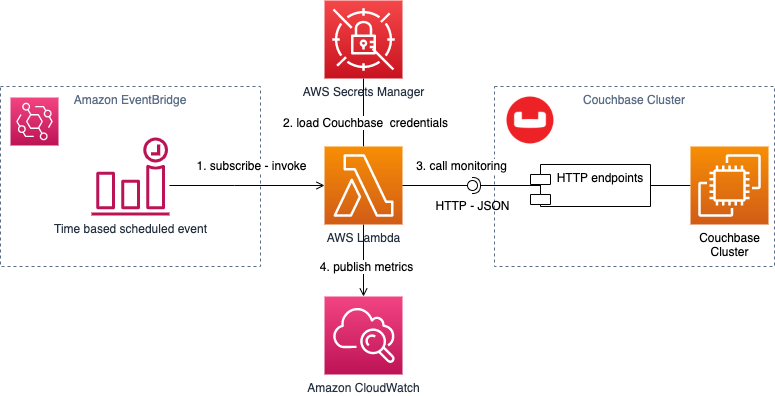
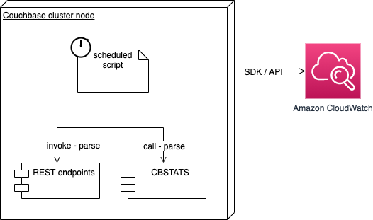
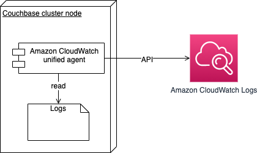

<!-- Copyright Amazon.com, Inc. or its affiliates. All Rights Reserved. SPDX-License-Identifier: MIT-0 -->

## Amazon Cloudwatch For Couchbase
Leverage AWS services to create cost-effective serverless architectures to enable monitoring of Couchbase clusters 
using Amazon CloudWatch.

[Amazon CloudWtach](https://aws.amazon.com/cloudwatch/ "Amazon CloudWtach") provides scalable and reliable 
monitoring and observability for your resources on many levels. 
Using metrics monitoring you get visibility on how your resource is performing under operational conditions.
You can use alarms to watch for single or composite metrics to trigger notifications or automatic actions 
based on the value of the metric or expression relative to a threshold over a number of time periods.
Amazon CloudWatch provides an API and SDK integrations so that you can send metrics supplemented by dimensions
to enable custom resources monitoring.
You can leverage CloudWatch to add additional monitoring capabilities 
for operational system that does not natively integrate with CloudWatch.

This enables a single plane for monitoring your AWS resources as well as other systems through CloudWatch.

### HTTP endpoint Monitoring

Couchbase clusters provide cluster endpoints that send information about the cluster health. 
Couchbase clusters also provide Bucket specific endpoints 
that monitor the performance of the operations in relation to the Buckets.

This is a serverless architecture that provides an example on how to
monitor the state of a Couchbase cluster via its HTTP/JSON APIs.
This information will be forwarded to Amazon CloudWatch as metrics to monitor 
Couchbase cluster during its operation.

The architecture above deploys the following resources.

1. An AWS Secrets Manager secret to store the cluster credentials.
1. An AWS Lambda function that
   1. Looks up cluster credentials from the mentioned secret.
   1. Calls the cluster endpoints for cluster and bucket telemetry.
   1. Parses and forwards metrics it to Amazon CloudWatch with proper dimensions.
1. An AWS EventBridge rule that calls the Lambda continuously based on a schedule. 

Follow the following [guidelines to deploy rest monitoring sample](http_monitoring/README.md)
### Internal node Monitoring

CLI tools like CBSTATS, that ships with Couchbase also provides telemetry capabilities. 
CBSTATS has a parameter to allow for text or JSON output format.

The architecture above describes a script to call the health endpoints and CBSTATS tool. 
The script parse the output and forwards metrics to CloudWatch with proper dimensions.
You can use node host schedule capabilities to schedule contentiously calling the monitoring script.

Check [sample script for node internal monitoring](./cli_monitoring/README.md)

### Logs monitoring

Couchbase provides a lot of log events in multiple log files around significant operational events.

CloudWatch Logs provides a cost-effective, reliable and scalable service to aggregate and index your application logs.
Through unified CloudWatch Logs agent, logs can be shipped to CloudWatch Logs to monitoring the Couchbase cluster logs.
For more information about using the unified CloudWatch agent to get started with CloudWatch Logs, 
see [Collect Metrics and Logs from Amazon EC2 Instances and On-Premises Servers with the CloudWatch Agent](https://docs.aws.amazon.com/AmazonCloudWatch/latest/monitoring/Install-CloudWatch-Agent.html) 
in the Amazon CloudWatch User Guide.

Check examples for [Amazon CloudWatch Logs unified agent configuration](./logs_monitoring/README.md).
### Getting started

1. Follow the following [guidelines to deploy rest monitoring sample](http_monitoring/README.md). 
   You can deploy the rest monitoring solution example by getting started with [SAM model](https://github.com/aws/serverless-application-model).
1. Check [sample script for node internal monitoring](./cli_monitoring/README.md).
1. Check examples for [Amazon CloudWatch Logs unified agent configuration](./logs_monitoring/README.md).

## FAQs

### Q: Which component should I get started with?

The samples repository provides guidance on 2 main topics,
1. monitoring metrics via CloudWatch 
1. and shipping logs to CloudWatch Logs
   
For the first point you have 2 choices based on the degree you control your cluster nodes.

a. If you have access to install scripts and packages on the cluster nodes, 
then consider node monitoring through internal monitoring script.

b. If you are not able to install packages on the node, 
then you can externally monitor your cluster by deploying HTTP endpoints.

For the second point, if you want to access your node logs via CloudWatch Logs, then check the guidance to ship logs 
via the unified agent. 

### Q: How can I add a new question to this list?

If you found yourself wishing this set of frequently asked questions had an answer for a particular problem, please [submit a pull request](https://help.github.com/articles/creating-a-pull-request-from-a-fork/). The chances are good that others will also benefit from having the answer listed here.

### Q: How can I contribute?

See the [Contributing Guidelines](CONTRIBUTING.md) for details.

## Security

See [CONTRIBUTING](CONTRIBUTING.md#security-issue-notifications) for more information.

## License

This library is licensed under the MIT-0 License. See the LICENSE file.

