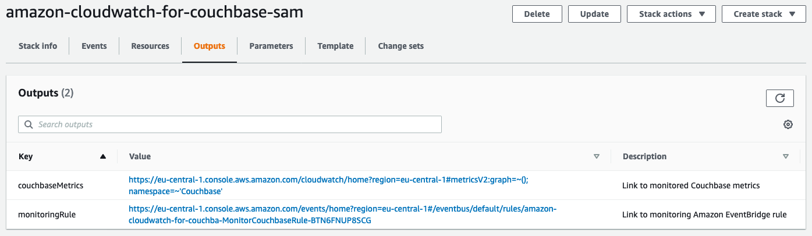
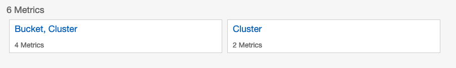
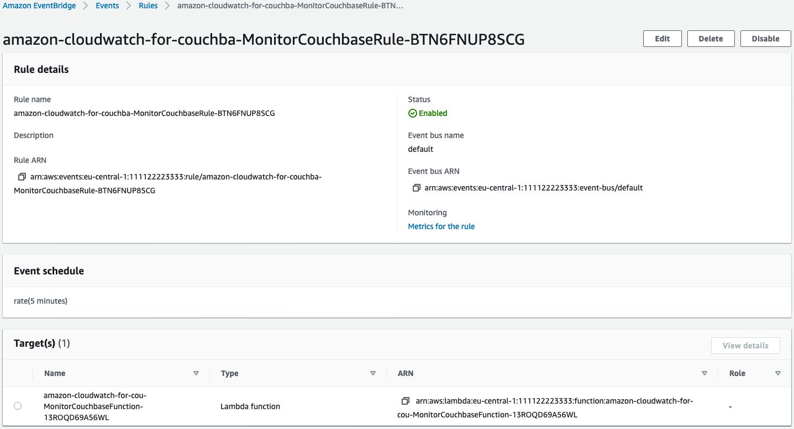

<!-- Copyright Amazon.com, Inc. or its affiliates. All Rights Reserved. SPDX-License-Identifier: MIT-0 -->

## HTTP endpoint monitoring

### Get Started

1. Clone the GitHub repository to your local machine.
1. Go to `http_monitoring/infrastructure` directory
1. Install the [AWS CLI](https://docs.aws.amazon.com/cli/latest/userguide/installing.html)
   & [AWS Serverless Application Model (SAM) CLI](https://docs.aws.amazon.com/serverless-application-model/latest/developerguide/serverless-sam-cli-install.html).
1. Validate your template:

    ```sh
    $ sam validate -t template.yaml
    ```
1. Deploy the template using guided mode to guide you through the parameters needed
    ```sh
    $ sam deploy -g -t template.yaml
    ```

### Check resources you deployed

As soon as the application is deployed completely the outputs of the 
AWS CloudFormation stack provides the links for the next steps. 
You will find two URLs in the AWS CloudFormation console called `couchbaseMetrics` and `monitoringRule`.



* Use the `couchbaseMetrics` link from the outputs, 
  or navigate to the Amazon CloudWatch Metrics in the console to inspect metrics created for the Couchbase cluster 
  and cluster/bucket. 
  Please note that initial metrics will take 10 mins or so to displayed.

  

* Use the `monitoringRule` link from the outputs, or navigate to the AWS EventBridge Rule in the console 
  to inspect the 5-minute scheduled rule created to invoke the lambda function that will call cluster `URL` 
  and create metrics.

  

### Clean up

You can always destroy all resources deployed by SAM by [deleting the corresponding deployed AWS CloudFormation Stack](https://docs.aws.amazon.com/AWSCloudFormation/latest/UserGuide/cfn-console-delete-stack.html).

### FAQs

#### Q: Does this SAM template deploy its own couchbase cluster?

No, the templates expects that the cluster is deployed and takes the cluster URL and ports as a parameter.

#### Q: Why do I provide VPC parameters then?

The VPC parameters are for a VPC that has network reachability to your Couchbase cluster.
In most setups the cluster would be launched in a private VPC. The template launches an AWS Lambda function and 
attaches an [Elastic network interface (ENI)](https://docs.aws.amazon.com/AWSEC2/latest/UserGuide/using-eni.html) 
to the Lambda function. The ENI is launched in the specified VPC and expects that the VPC has connectivity to 
Couchbase cluster.
The same VPC that has your cluster can be specified, you can also specify another VPC that has connectivity to 
the Couchbase cluster.

#### Q: How much do resources in this template cost?

Standard AWS charges apply to the resources you deploy with this template.

Please refer to pricing on the following resources:
* Amazon CloudWatch: The above deployment puts 2 metrics by default for a cluster and 2 metrics per bucket if configured.
* AWS Lambda: The above template uses the smallest lambda configuration of `128 mb` of memory and times out after `3 seconds`. The Lambda is invoked every `5 mins`.
* AWS EventBridge: One rule is created that invokes the Lambda function every `5 mins`.
* AWS SecretsManager: One seceret is created to hold cluster credentials and is accessed once every `5 mins` by the Lambda.
* Addition AWS Lambda ENI (Elastic Network Interface)s created in your VPC are created at no additional cost.
